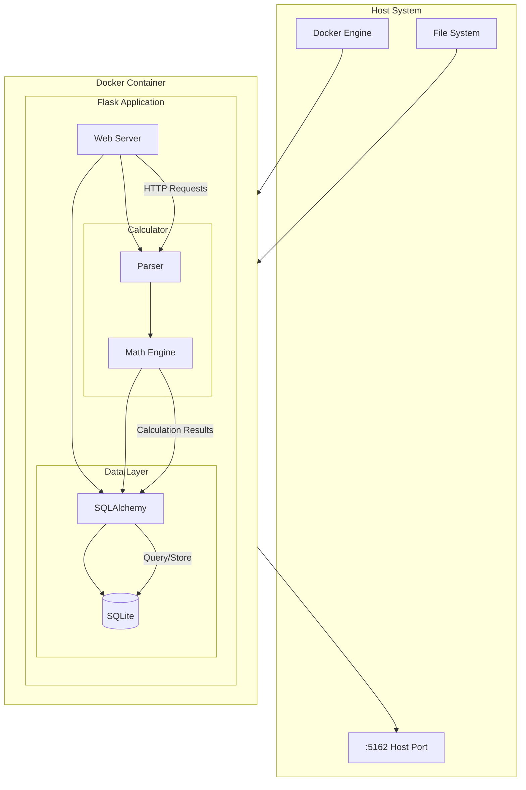

# Why Use Mermaid for Software Architecture Documentation

## Overview
This repository demonstrates the power of Mermaid diagrams for documenting software architecture, particularly in an LLM-driven development world.

## Benefits

### 1. LLM-Friendly
- Plain text format that can be parsed by language models
- Version control friendly - easy to track changes
- Enables AI-assisted diagram updates and analysis

### 2. Developer Experience
- Write diagrams using simple markdown-like syntax
- No need for external diagramming tools
- Renders directly in GitHub and many markdown editors

### 3. Architecture Visibility
- Clear visualization of system components
- Easy to understand data flow
- Hierarchical structure through subgraphs

### 4. Example Architecture
Our calculator application architecture visualized with Mermaid:



## Getting Started

1. Use Mermaid in your markdown:
   ```mermaid
   graph TD
       A-->B
   ```


2. Commit to your repository - GitHub will render automatically

3. For local development:
   - VS Code: Install "Markdown Preview Mermaid Support" extension
   - JetBrains: Built-in support available

## Resources
- [Mermaid Official Documentation](https://mermaid.js.org/)
- [GitHub Mermaid Support](https://github.blog/2022-02-14-include-diagrams-markdown-files-mermaid/)
